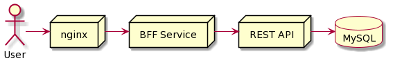

From RFC 2616 Section 1.3:

> **upstream/downstream**
> Upstream and downstream describe the flow of a message: all messages flow from upstream to downstream.

https://datatracker.ietf.org/doc/html/rfc2616#section-1.3:~:text=of%20an%20entity.-,upstream/downstream,-Upstream%20and%20downstream

# Is it "upstream" or "downstream"?

Here's a request diagram of your web stack:



The users starts **_downstream_**.

The MySQL is the most **_upstream_** service.

For example, in this request diagram, we could say:

- _The REST API is upstream of nginx_
- _The BFF Service is downstream of MySQL_

# "You're wrong, it depends on which way you look at it"

Upstream vs downstream can indeed be flipped depending on if you're talking about a request or a response. But nobody ever does that and just says "downstream" or "upstream" without the added context of a direction.

So for places where we're picking a word without the directional context, "upstream" seems correct given usage of it in other places (e.g. nginx makes you configure "upstreams" referring to the proxy target, a git upstream etc)

Finally, here's how RFC2616 defines the 502 Status Code:

```
10.5.3 502 Bad Gateway

   The server, while acting as a gateway or proxy, received an invalid
   response from the upstream server it accessed in attempting to
   fulfill the request.
```

If "upstream" is good enough for RFC2616, it's good enough for me.

# Cool! I'll tell all my friends and family and use "upstream/downstream" correctly in my RFCs!

Or...not!

Let's be honest, "upstream vs downstream" is super easy to get mixed up and can be confusing terminology as a result.

So - for the sake of clarity, consider using non-ambiguous english - e.g. **"service we're calling"** or **"service that called us"**.

🎉

# Prior art

- https://twitter.com/JemYoung/status/1352349935933419521
- https://stackoverflow.com/questions/32364579/upstream-downstream-terminology-used-backwards-e-g-nginx/32365658#32365658
